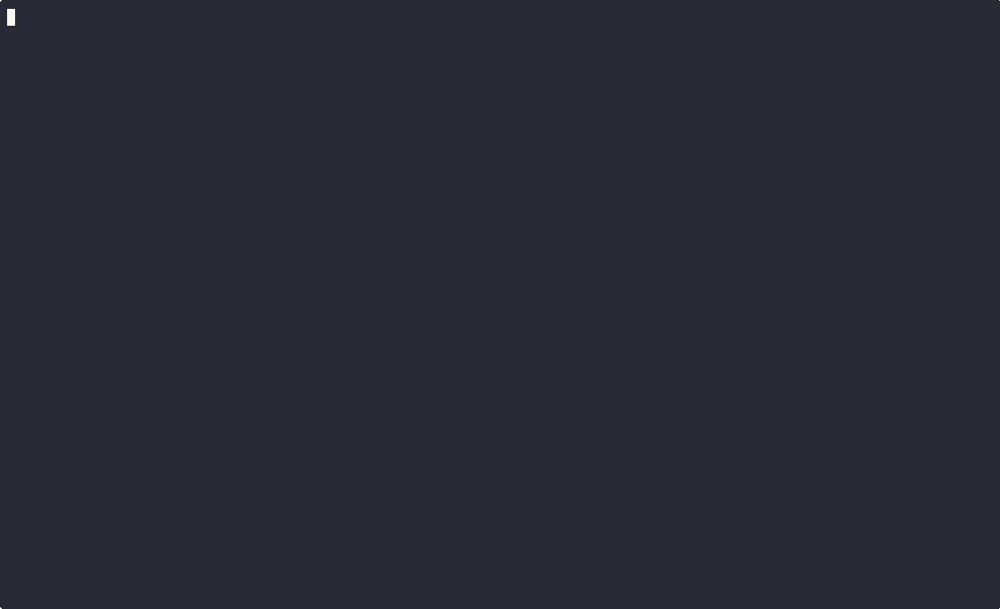

# Snake Telnet

A classic Snake game playable over telnet! Connect to the server and enjoy the nostalgic snake game directly in your terminal.



## Features

- Classic snake gameplay with WASD/Arrow key controls
- Real-time multiplayer leaderboard system
- Nickname support for score tracking
- Persistent high scores stored locally
- Clean terminal-based UI with proper telnet protocol handling

## Installation

```bash
# Clone the repository
git clone <repository-url>
cd snake-telnet

# No dependencies required! Uses only Node.js built-in modules
```

## Usage

### Start the Server

```bash
npm start
# or
node server.js
```

The server will start on port 2323 by default.

### Connect to Play

From any terminal with telnet installed:

```bash
telnet localhost 2323
```

## How to Play

1. **Enter your nickname** when prompted (optional, but required for leaderboard)
2. **Press SPACE** to start the game
3. **Use controls**:
   - `W` or `↑` - Move up
   - `S` or `↓` - Move down  
   - `A` or `←` - Move left
   - `D` or `→` - Move right
4. **Eat the food** (`*`) to grow and increase your score
5. **Avoid** walls and your own tail
6. **Press L** at the main menu to view the leaderboard
7. **Press R** to restart after game over
8. **Press Q** to quit

## Game Rules

- The snake continuously moves in the current direction
- Eating food increases your score and snake length
- Hitting walls or your own body ends the game
- High scores are automatically saved to the leaderboard

## Technical Details

- Built with Node.js using only built-in modules (no dependencies)
- Implements proper telnet protocol negotiation for real-time input
- Features atomic file operations for concurrent leaderboard updates
- Character-by-character input handling for responsive controls

## License

MIT